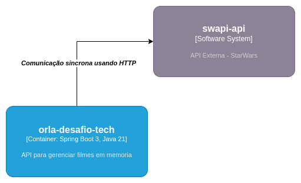

# desafio-tecnico

Projeto responsável por gerenciar filmes do star wars em memoria

* Integração com Swapi API
* API's para gestão de filmes


# Considerações

* A API da Swapi StarWars está com o certificado SSL vencido, poderiamos ignorar essa verificação
mas o código iria ficar bastante sujo, então foi criado um MockServer nos testes e desenvolvido 
o desafio.

# Arquitetura




# Tecnologias

* spring boot 3x
* java 21
* resilience4J

### Lint (spotless)

` mvn spotless:apply`

### Tests 

`mvn clean install` ou `mvn test`


### Executar via CLI

`mvn spring-boot:run`

### Executar via Jar File

`mvn clean install`

`java -jar target/orla-api-0.0.1-SNAPSHOT.jar`

### Executar via Docker

`docker build . -t desafio-tech`

`docker run -i desafio-tech`

### Executar Trivy Security

`mvn clean package -DskipTests`

`mvn tech.orla:trivy-maven-plugin:trivy-scan`


### Documentação REST

* Listar filmes

`GET http://localhost:8080/v1/films`

* Filtrar filme por saga

`GET http://localhost:8080/v1/films?saga_id=4`

* Atualizar Filme

`PUT http://localhost:8080/v1/films/{episode_id}`

request body
```json
{
  "opening_crawl": "new description"
}
```

* Vizualiar detalhes de um filme

`GET http://localhost:8080/v1/films/4`
